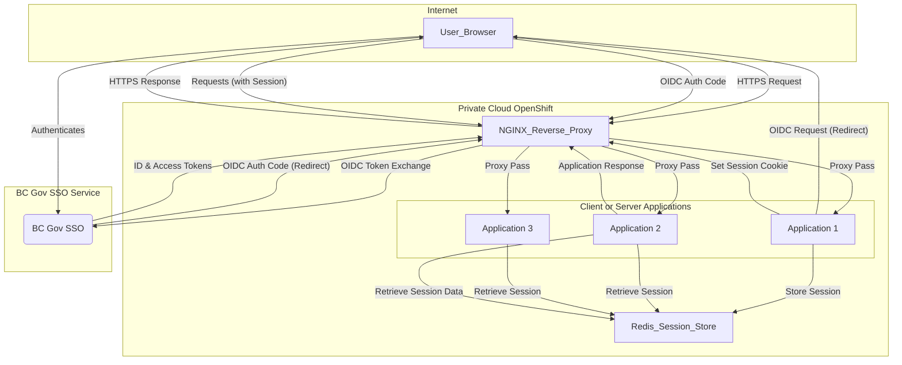

# Secure Web Application Architecture with BC Government Keycloak SSO

Scalable NGINX-based reverse proxy architecture for web applications, with SSO client and session management. Can be integrated with the BC Government's Common Keycloak service for Single Sign-On (SSO).

## Table of Contents

1.  [Overview](#overiew)
2.  [Components](#components)
3.  [Architecture](#architecture)
4.  [Authentication and Session Flow](#authentication-and-session-flow)
5.  [Setup Considerations](#setup-considerations)
7.  [Security Best Practices](#security-best-practices)

## Overview

This architecture is designed to provide a secure, high-performance, and scalable foundation for web applications. By utilizing NGINX as a reverse proxy, we centralize request handling, enable SSL termination, and facilitate load balancing. The Node.js application focuses on business logic, offloading authentication to the BC Government's Common Keycloak service via OpenID Connect (OIDC). User sessions are managed efficiently and externalized to Redis, allowing for seamless scaling and resilience.

## Components

### NGINX Reverse Proxy
Entry point for incoming requests. Provides SSL/TLS Termination to handle HTTPS encryption and decryption; Directs incoming traffic

### BC Government Common Keycloak Service (OIDC)
Centralized Identity and Access Management (IAM) provider for BC Government applications. Uses OpenID Connect (OIDC) protocol used for secure communication and identity verification.

### NodeJS Client Application

OIDC Client that initiates authentication requests to Keycloak and processes the authorization codes/tokens returned; Exposes APIs for frontend consumption. Creates and manages user sessions, storing essential session data (e.g., user ID, access token, refresh token) in Redis.

### Redis Session Store
External, high-performance, in-memory data store for user sessions.


## Architecture



## Authentication and Session Flow

1.  **Initial Request:** Send HTTPS request to application's domain (e.g., `https://myapp.gov.bc.ca`).
2.  **NGINX Proxy:** NGINX receives the request, terminates SSL, and forwards it to a Node.js application instance (via a load balancer, if present).
3.  **Authentication Check (Node.js):** The Node.js application checks for an existing, valid session (e.g., via a session cookie).
4.  **Redirect to Keycloak:** If no valid session exists, the Node.js application initiates an OIDC authorization code flow by redirecting the user's browser to the BC Government's Keycloak login page, including `client_id`, `redirect_uri`, `scope`, and `response_type`.
5.  **Keycloak Authentication:** The user logs in to Keycloak using their BCeID or other supported credentials.
6.  **Authorization Code Grant:** Upon successful authentication, Keycloak redirects the user's browser back to the Node.js application's `redirect_uri` with an authorization code.
7.  **Token Exchange (Node.js):** The Node.js application receives the authorization code and exchanges it directly with Keycloak (server-to-server) for ID, Access, and Refresh Tokens. This exchange is secure and bypasses the user's browser.
8.  **Session Creation (Node.js & Redis):** The Node.js application validates the received tokens. It then creates a server-side session, storing relevant user details (from the ID Token), the Access Token, and the Refresh Token in Redis, associated with a unique session ID.
9.  **Session Cookie:** The Node.js application sends a `Set-Cookie` header to the user's browser containing the session ID (e.g., `connect.sid`). This cookie is typically `HttpOnly` and `Secure`.
10. **Authorized Access:** For all subsequent requests within the session, the user's browser sends the session ID cookie.
11. **Session Retrieval (Node.js & Redis):** The Node.js application retrieves the session data from Redis using the session ID from the cookie.
12. **Token Validation/Refresh:** The Node.js application validates the Access Token. If expired, it uses the Refresh Token to obtain new Access and ID Tokens from Keycloak without user re-authentication.
13. **Resource Access:** If the session and tokens are valid, the Node.js application grants access to the requested resources.

## Setup Considerations

### BC Gov Keycloak Integration

  * **Client Registration:** Your application must be registered as a client within the BC Government's Keycloak realm. You will need to obtain a `client_id` and `client_secret`.
  * **Redirect URIs:** Configure all valid `redirect_uri`s for your application in Keycloak (e.g., `https://myapp.gov.bc.ca/auth/callback`).
  * **Public/Confidential Client:** For Node.js (server-side), it's typically configured as a `confidential` client as it can securely store the `client_secret`.
  * **Scope:** Define the necessary OIDC scopes (e.g., `openid`, `profile`, `email`) your application requires.

### NGINX Configuration

  * **SSL/TLS:** Configure SSL certificates (e.g., from Let's Encrypt or BC Gov provided certificates) for your domain.
  * **Proxy Pass:** Set up `proxy_pass` directives to forward requests to your Node.js application instances (or a load balancer).
  * **HTTP Headers:** Ensure correct `X-Forwarded-For`, `X-Real-IP`, and `X-Forwarded-Proto` headers are passed to Node.js for accurate request context.
  * **Error Pages:** Configure custom error pages.

**Example NGINX Snippet (simplified):**

```nginx
server {
    listen 80;
    server_name myapp.gov.bc.ca;
    return 301 https://$host$request_uri;
}

server {
    listen 443 ssl;
    server_name myapp.gov.bc.ca;

    ssl_certificate /etc/nginx/ssl/myapp.gov.bc.ca.crt;
    ssl_certificate_key /etc/nginx/ssl/myapp.gov.bc.ca.key;
    ssl_protocols TLSv1.2 TLSv1.3;
    ssl_ciphers HIGH:!aNULL:!MD5; # Ensure strong ciphers

    location / {
        proxy_pass http://localhost:3000; # Or your Node.js app's internal IP/port
        proxy_set_header Host $host;
        proxy_set_header X-Real-IP $remote_addr;
        proxy_set_header X-Forwarded-For $proxy_add_x_forwarded_for;
        proxy_set_header X-Forwarded-Proto $scheme;
        proxy_redirect off;
    }
}
```

### SSO Client Configuration

  * **OIDC Client Library:** Use a robust OIDC client library (uses `openid-client`) to handle the OIDC flow.
  * **Environment Variables:** Store sensitive configuration like Keycloak `client_id`, `client_secret`, and Redis connection details as environment variables.
  * **Session Middleware:** Integrate a session management middleware (e.g., `express-session` with a Redis store like `connect-redis`).
  * **Token Management:** Implement logic to store, validate, and refresh Access Tokens using the Refresh Token.

**Example Node.js `express-session` with `connect-redis` (simplified):**


## Security Best Practices

  * **Always use HTTPS:** Enforce HTTPS for all traffic using NGINX.
  * **Strong Session Secrets:** Use long, random, and frequently rotated secrets for session management.
  * **Secure Cookies:** Mark session cookies as `HttpOnly`, `Secure`, and `SameSite` (Lax or Strict).
  * **Input Validation:** Sanitize and validate all user inputs to prevent injection attacks.
  * **Rate Limiting:** Implement rate limiting on NGINX to mitigate brute-force attacks.
  * **Regular Updates:** Keep all software components (NGINX, Node.js, Redis, libraries) updated to their latest stable versions.
  * **Least Privilege:** Configure permissions for your application and database users with the principle of least privilege.
  * **Logging and Monitoring:** Implement comprehensive logging and monitoring to detect and respond to security incidents.
  * **OWASP Top 10:** Familiarize yourself with and address the OWASP Top 10 security risks.

-----
